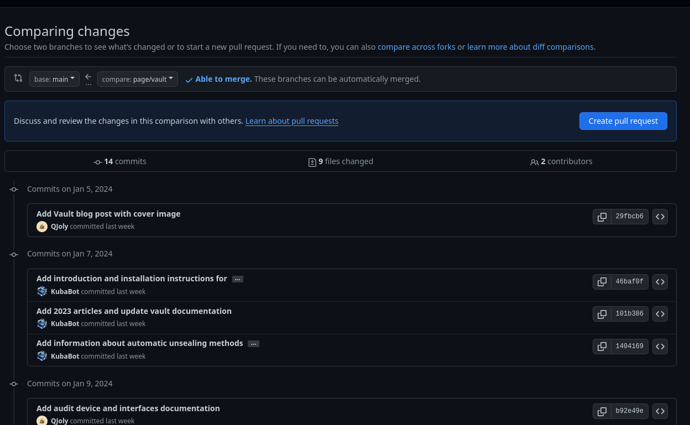
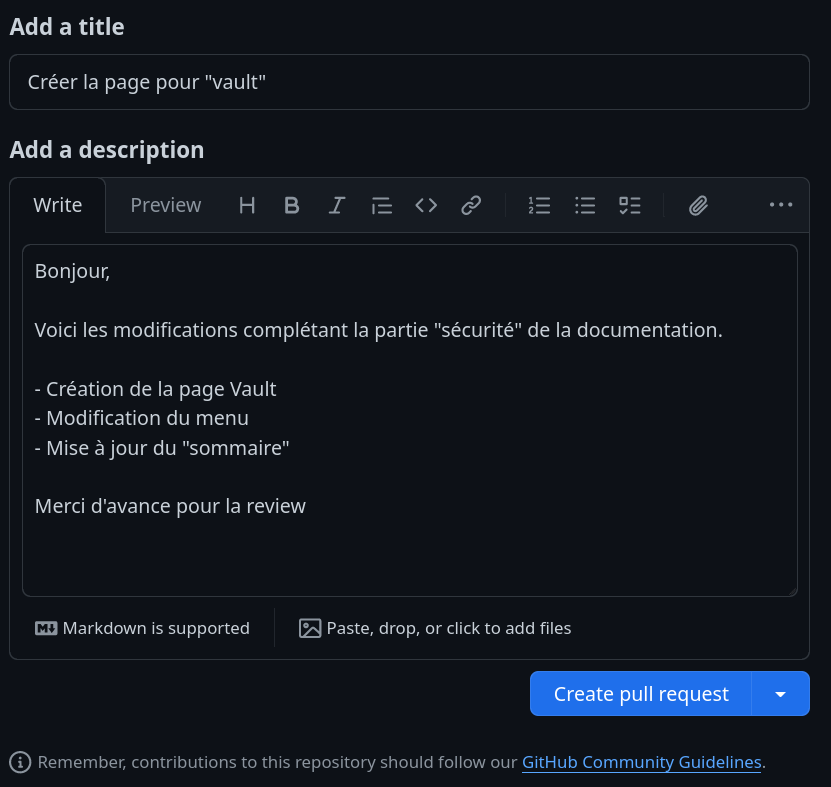
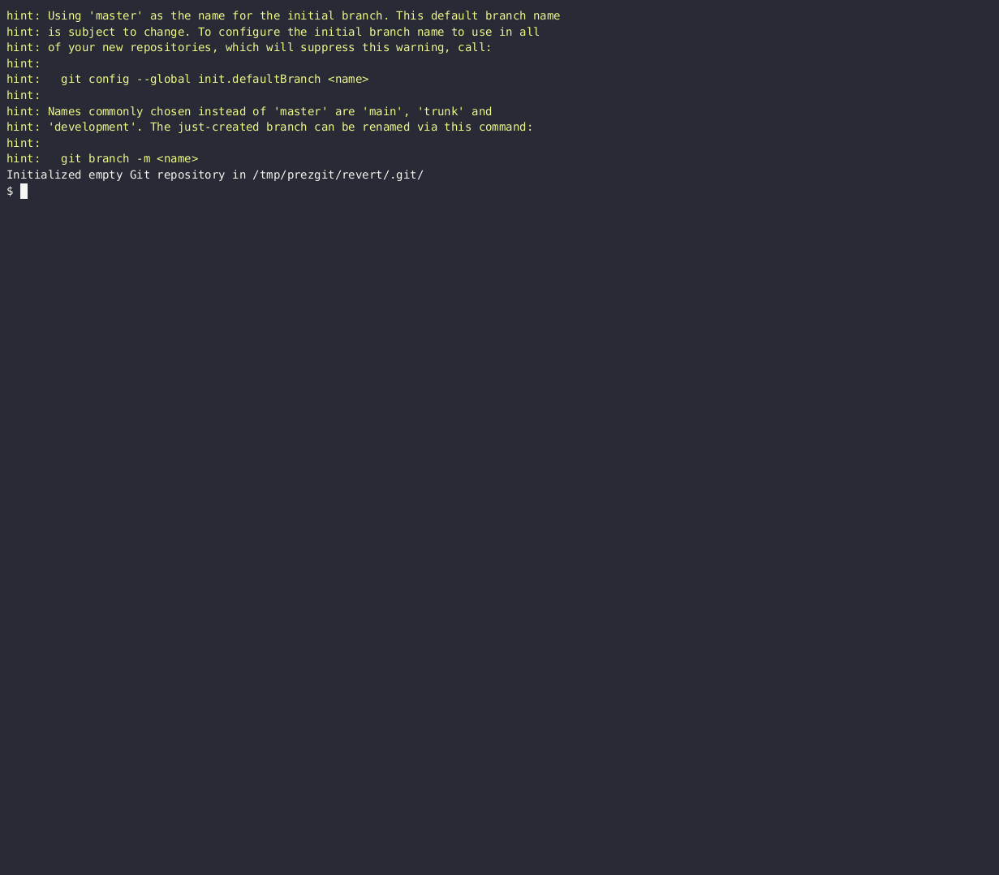

<style>
p, li {
    font-size: 25px;
}
video {
  display: block;
  margin: auto;
}

img[alt~="center"] {
  display: block;
  margin: 0 auto;
}

video::-webkit-media-controls {
    will-change: transform;
}

section.sommaire li {
    font-size: 20px;
}

</style>

<!-- _class: lead invert -->
<!-- transition: cover -->

<title> Git avec une tasse de café </title>
<!-- Matomo -->
<script>
  var _paq = window._paq = window._paq || [];
  /* tracker methods like "setCustomDimension" should be called before "trackPageView" */
  _paq.push(['trackPageView']);
  _paq.push(['enableLinkTracking']);
  (function() {
    var u="//mat.une-tasse-de.cafe/";
    _paq.push(['setTrackerUrl', u+'matomo.php']);
    _paq.push(['setSiteId', '3']);
    var d=document, g=d.createElement('script'), s=d.getElementsByTagName('script')[0];
    g.async=true; g.src=u+'matomo.js'; s.parentNode.insertBefore(g,s);
  })();
</script>
<!-- End Matomo Code -->


CyberPrez #04 - Git
# Découvrir Git 


---
<!-- _class: lead invert sommaire -->

# Qu'est-ce que Git ?

---
<!-- _class: lead invert -->

- Git est un logiciel de gestion de versions décentralisé. C'est un logiciel libre créé par Linus Torvalds, auteur du noyau Linux, et distribué selon les termes de la licence publique générale GNU version 2.

- Il permet de stocker un ensemble de fichiers en conservant la chronologie de toutes les modifications qui ont été effectuées dessus. Il permet donc de revenir à n'importe quelle version antérieure du projet.

---
<!-- _class: lead invert -->

# Pourquoi utiliser Git ?

- Développeurs: pour gérer les versions de votre code, travailler à plusieurs sur un même projet, gérer les conflits, etc.
- Ops: pour gérer les versions de vos scripts, de vos configurations, automatiser vos déploiements, etc.

---
<!-- _class: lead invert -->

# Installer Git

- Sur Linux, il suffit d'installer le paquet git via le gestionnaire de paquets de votre distribution.

- Sur Windows, il faut télécharger le logiciel sur le [site officiel](https://git-scm.com/downloads).

---
<!-- _class: lead invert -->

# Créer un dépôt Git

- Pour créer un dépôt Git, il suffit de se placer dans le répertoire du projet et d'exécuter la commande suivante :

```bash
git init
```

Git va alors créer un répertoire caché nommé .git qui contiendra toutes les informations nécessaires au fonctionnement de Git.

---

# Ajouter des fichiers au dépôt

- Pour ajouter des fichiers au dépôt, il faut utiliser la commande suivante :

```bash
git add <nom du fichier>
```

Les fichiers ajoutés sont alors placés dans la zone de transit (staging area).

--- 

# Qu'est ce que la zone de transit ?

- La zone de transit est un espace de stockage temporaire qui permet de préparer les fichiers à être commités.
- Elle permet de sélectionner les fichiers à ajouter au prochain commit.


*source: [mdwithml](https://madewithml.com/courses/mlops/git)*

---

# Commiter les fichiers

Un commit est une validation des modifications effectuées sur les fichiers du projet. Celui-ci est identifié par un hash SHA-1 et contient les informations suivantes :
- L'auteur du commit
- La date du commit
- Le message du commit
- Les fichiers modifiés

Lorsque l'on clone un dépôt Git, on récupère l'ensemble des commits du projet.

---
<!-- _class: lead invert -->

Pour commiter les fichiers, il faut utiliser la commande suivante *(après avoir ajouté les fichiers à la zone de transit)* :

```bash
git commit -m "Message du commit"
```

Une fois les fichiers commités, ils sont stockés dans le répertoire `.git`. Il est possible de revenir à n'importe quel commit du projet grâce à son hash.

---
<!-- _class: lead invert -->

Pour afficher l'historique des commits, il faut utiliser la commande suivante :

```bash
git log # Affiche l'historique des commits
```

```console
commit bcd990e8f75b45785092e81ce8e1611531102fe3 (HEAD -> main, origin/main, origin/HEAD)
Author: QJoly <github@une-tasse-de.cafe>
Date:   Thu Jan 11 07:25:58 2024 +0100

    Ajout du fichier README.md
```

---
<!-- _class: lead invert -->

# Envoyer les commits sur un serveur distant

---

Il existe de nombreux services qui permettent d'héberger des dépôts Git :
- GitHub (le plus connu)
- GitLab (le plus complet)

Ces sites sont des plateformes de collaboration qui permettent de travailler à plusieurs sur un même projet. On y retrouve de nombreux projets open source accessibles à tous.

Pour envoyer les commits sur un serveur distant, il faut utiliser la commande suivante :

```bash
git branch -M main # Renomme la branche actuelle en "main"
git remote add origin git@github.com:QJoly/PrezGit.git # Ajoute le serveur distant "origin"
git push -u origin main # Envoie les commits sur le serveur distant
```

---

## Qu'en est-il du cas où nous travaillons à plusieurs sur un même projet ?

- Il est nécessaire de récupérer les commits (modifications) des autres collaborateurs avant de pouvoir envoyer les siens.  
- Besoin de pouvoir gérer les conflits lorsque 2 collaborateurs ont modifié le même fichier.

Pour récupérer les commits des autres collaborateurs, il faut utiliser la commande suivante :

```bash
git pull
```

---

## Les branches

Une branche est une version parallèle du projet. Elle permet de travailler sur une fonctionnalité sans impacter le reste du projet. 


Une fois la fonctionnalité terminée, il suffit de fusionner la branche avec la branche principale.

---

## Changer de branche

- Pour changer de branche, il faut utiliser la commande suivante :

```bash
git checkout <nom de la branche>
```

- Pour voir la liste des branches, il faut utiliser la commande suivante :

```bash
git branch
```

- Pour créer une nouvelle branche, il faut utiliser la commande suivante :

```bash
git checkout -b <nom de la branche>
```

---

## Fusionner des branches

Pour fusionner une branche avec la branche principale, il faut utiliser la commande suivante :

```bash
git merge <nom de la branche>
# exemple
git merge feat/ajout-fichier
```

Cela va avoir pour effet de créer un nouveau commit qui contiendra les modifications de la branche `feat/ajout-fichier` vers la branche sur laquelle on se trouve.

---

## Proposer des modifications

Lorsque l'on travaille sur un projet open source, il est nécessaire de pouvoir proposer des modifications au projet. On appelle cela une pull request (PR) ou une merge request (MR).
<i style="font-size: 70%;">note: les deux termes sont utilisés selon la plateforme utilisée (GitHub ou GitLab) mais représentent la même chose.</i>

Il faut alors créer une branche qui contiendra les modifications à apporter au projet. Une fois les modifications terminées, il faut envoyer la branche sur le serveur distant et créer une PR/MR.

Un mainteneur du projet pourra alors valider, ou réclamer des modifications, avant de fusionner la branche avec la branche principale.

---

Pour créer une MR/PR, il faut procéder aux étapes suivantes:
- Créer une branche
- Ajouter les modifications
- Envoyer la branche sur le serveur distant
- Créer une MR/PR



---

Quelques règles:
- Détaillez les modifications apportées.
- Ajoutez des images/log si nécessaire.
- Ajoutez des labels*.
- Soyez courtois et patient.

<i style="font-size: 70%;">Les labels sont des "étiquettes" qui permettent de catégoriser les MR/PR et de les retrouver plus facilement (ex: bug, enhancement, etc.).</i>



---

## Gérer les conflits

Lorsque l'on travaille à plusieurs sur un même projet, il est possible que deux collaborateurs aient modifié le même fichier. Dans ce cas, il y a un conflit.

Pour résoudre un conflit, Git vous place dans un état spécial appelé "état de conflit". Il faut alors ouvrir le fichier en conflit et résoudre le conflit manuellement. Une fois le conflit résolu, il faut ajouter le fichier au prochain commit.

En modifiant le fichier, on supprime les marqueurs de conflit (`<<<<<<<, =======, >>>>>>>`) et on garde uniquement le code que l'on souhaite conserver.

---


---

## Annuler un commit

Il existe plusieurs méthodes pour annuler un commit :
- Ajouter un commit en annulant un autre (`revert`)
- Forcer la suppression d'un commit avec perte de l'historique (`rebase`)
- Forcer le retour arrière jusqu'à un certain commit (`reset`)

:warning: Attention, je souhaite modifier un fichier ayant eu plusieurs commits : il y aura des conflits.

---

### Annuler un commit via un revert

```bash
cd $(mktemp -d) && git init
for i in `seq -w 1 3`; do echo "$i" > "$i" ; git add "$i"; git commit -m "$i"; done;
# Je souhaite supprimer le commit créant le fichier "2"
git revert HEAD^ # HEAD^ = avant-dernier commit
ls
1 3
# le fichier "2" est bien supprimé
```

---



---

## Modifier la branche du dernier commit

```bash
# Annuler le précédent commit, mais garder les modifications
git reset HEAD~ --soft
git stash
# modification sauvegardée dans stash, se placer sur la bonne branche
git checkout name-of-the-correct-branch
git stash pop
git add .
git commit -m "Ma modification ici";
```

--- 

## Ajouter des modifications au dernier commit

```bash
cd $(mktemp -d)
git init
for i in `seq -w 1 3`; do echo "$i" | tee -a FICHIER; git add FICHIER; git commit -m "$i"; done;
###
git add . 
git commit --amend --no-edit
```

--- 

## Sauvegarder des modifications non-commitées (stash)

```bash
git stash
git stash pop # Applique les fichiers, et supprime la pile
git stash apply # Applique les fichiers en gardant la pile
```
