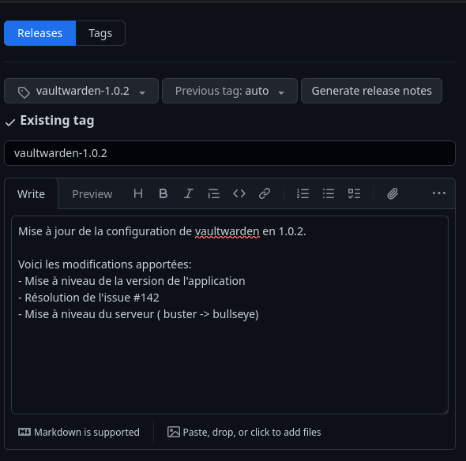

<style>
p, li {
    font-size: 25px;
}
video {
  display: block;
  margin: auto;
}

img[alt~="center"] {
  display: block;
  margin: 0 auto;
}

video::-webkit-media-controls {
    will-change: transform;
}

section.sommaire li {
    font-size: 20px;
}

</style>

<!-- _class: lead invert -->
<!-- transition: cover -->

<title> Git avec une tasse de café </title>
<!-- Matomo -->
<script>
  var _paq = window._paq = window._paq || [];
  /* tracker methods like "setCustomDimension" should be called before "trackPageView" */
  _paq.push(['trackPageView']);
  _paq.push(['enableLinkTracking']);
  (function() {
    var u="//mat.une-tasse-de.cafe/";
    _paq.push(['setTrackerUrl', u+'matomo.php']);
    _paq.push(['setSiteId', '3']);
    var d=document, g=d.createElement('script'), s=d.getElementsByTagName('script')[0];
    g.async=true; g.src=u+'matomo.js'; s.parentNode.insertBefore(g,s);
  })();
</script>
<!-- End Matomo Code -->


# Découvrir Git

Avec une tasse de café


---
<!-- _class: lead invert sommaire -->

# Sommaire
*(1/3)*
- Qu'est-ce que Git?
    - [Qu'est-ce que Git ?](#4)
    - [Pourquoi utiliser Git ?](#5)
- La base de Git
  - [Installer Git](#6)
  - [Créer un dépôt Git](#7)
  - [Ajouter des fichiers en *staging*](#8)
  - [Qu'est-ce que la zone de transit ?](#9)
  - [Commiter les fichiers](#10)
  - [Envoyer les commits sur un serveur distant](#13)
- Maintenir un projet en équipe
  - [Les branches](#16)
  - [Changer de branche](#17)
  - [Fusionner des branches](#20)
---
<!-- _class: lead invert sommaire -->

# Sommaire
*(2/3)*

- Collaborer sur un projet
  - [Proposer des modifications](#21)
  - [Gérer les conflits](#24)
  - [Annuler un commit](#26)
    - [Via un revert](#27)
    - [Via un rebase](#29)
  - [Modifier la branche du dernier commit](#31)
  - [Ajouter des modifications au dernier commit](#32)
  - [Sauvegarder des modifications non commitées (stash)](#34)
  - [Squasher des commits](#35)
  - [les tags](#36)
  - [Release](#38)

---

# Sommaire
*(2/3)*

- Résolution de problèmes
  - [Git ne veut pas push mes commits](#40)
  - [Je ne peux pas changer de branche !](#41)
  - [Ma tête (HEAD) est détachée !](#42)
  - [Impossible de pull](#43)
  

---
<!-- _class: lead invert sommaire -->

# Qu'est-ce que Git ?

---
<!-- _class: lead invert -->
<!-- _header: 'Qu'est-ce que Git ?' -->


- Git est un logiciel de gestion de versions décentralisé. C'est un logiciel libre créé par Linus Torvalds, auteur du noyau Linux, et distribué selon les termes de la licence publique générale GNU version 2.

- Il permet de stocker un ensemble de fichiers en conservant la chronologie de toutes les modifications qui ont été effectuées dessus. Il permet donc de revenir à n'importe quelle version antérieure du projet.

---
<!-- _class: lead invert -->
<!-- _header: 'Git, pour qui ?' -->

# Pourquoi utiliser Git ?

- Développeurs: pour gérer les versions de votre code, travailler à plusieurs sur un même projet, gérer les conflits, etc.
- Ops: pour gérer les versions de vos scripts, de vos configurations, automatiser vos déploiements, etc.

---
<!-- _class: lead invert -->

# Installer Git

- Sur Linux, il suffit d'installer le paquet git via le gestionnaire de paquets de votre distribution.

- Sur Windows, il faut télécharger le logiciel sur le [site officiel](https://git-scm.com/downloads).

---
<!-- _class: lead invert -->

# Créer un dépôt Git

- Pour créer un dépôt Git, il suffit de se placer dans le répertoire du projet et d'exécuter la commande suivante :

```bash
git init
```

Git va alors créer un répertoire caché nommé .git qui contiendra toutes les informations nécessaires au fonctionnement de Git.

---

# Ajouter des fichiers au dépôt

- Pour ajouter des fichiers au dépôt, il faut utiliser la commande suivante :

```bash
git add <nom du fichier>
```

Les fichiers ajoutés sont alors placés dans la zone de transit *(staging area)*.

--- 

# Qu'est-ce que la zone de transit ?

- La zone de transit est un espace de stockage temporaire qui permet de préparer les fichiers à être commités.
- Elle permet de sélectionner les fichiers à ajouter au prochain commit.


*source: [mdwithml](https://madewithml.com/courses/mlops/git)*

---

# Commiter les fichiers

Un commit est une validation des modifications effectuées sur les fichiers du projet. Celui-ci est identifié par un hash SHA-1 et contient les informations suivantes :
- L'auteur du commit
- La date du commit
- Le message du commit
- Les fichiers modifiés.

Lorsque l'on clone un dépôt Git, on récupère l'ensemble des commits du projet.

---
<!-- _class: lead invert -->
<!-- _header: 'Les commits' -->

Pour commiter les fichiers, il faut utiliser la commande suivante *(après avoir ajouté les fichiers à la zone de transit)* :

```bash
git commit -m "Message du commit"
```

Une fois les fichiers commités, ils sont stockés dans le répertoire `.git`. Il est possible de revenir à n'importe quel commit du projet grâce à son hash.

<i style="font-size: 70%;">note: Il est possible de modifier le message du commit en utilisant l'option <code>--amend</code>. <a href="#32">Plus de détails sur la page 32</a> </i>

---
<!-- _class: lead invert -->
<!-- _header: 'Les commits' -->

Pour afficher l'historique des commits, il faut utiliser la commande suivante :

```bash
git log # Affiche l'historique des commits
```

```console
commit bcd990e8f75b45785092e81ce8e1611531102fe3 (HEAD -> main, origin/main, origin/HEAD)
Author: QJoly <github@une-tasse-de.cafe>
Date:   Thu Jan 11 07:25:58 2024 +0100

    Ajout du fichier README.md
```

---
<!-- _class: lead invert -->
<!-- _header: 'Les commits' -->

# Envoyer les commits sur un serveur distant

---
<!-- _header: 'Les commits' -->

Il existe de nombreux services qui permettent d'héberger des dépôts Git :
- GitHub (le plus connu)
- GitLab (le plus complet)

Ces sites sont des plateformes de collaboration qui permettent de travailler à plusieurs sur un même projet. On y retrouve de nombreux projets open source accessibles à tous.

Pour envoyer les commits sur un serveur distant, il faut utiliser la commande suivante :

```bash
git branch -M main # Renomme la branche actuelle en "main"
git remote add origin git@github.com:QJoly/PrezGit.git # Ajoute le serveur distant "origin"
git push -u origin main # Envoie les commits sur le serveur distant
```

---
<!-- _header: 'Collaborer' -->

## Qu'en est-il du cas où nous travaillons à plusieurs sur un même projet ?

- Il est nécessaire de récupérer les commits *(modifications)* des autres collaborateurs avant de pouvoir envoyer les siens.  
- Besoin de pouvoir gérer les conflits lorsque deux collaborateurs ont modifié le même fichier.

Pour récupérer les commits des autres collaborateurs, il faut utiliser la commande suivante :

```bash
git pull
```

---

## Les branches

Une branche est une version parallèle du projet. Elle permet de travailler sur une fonctionnalité sans impacter le reste du projet avant de la fusionner avec la branche principale ou de maintenir une version alternative.


Une fois le code terminé, il suffit de fusionner la branche avec la branche principale pour l'intégrer au code 'stable'.

*Il convient de nommer une branche avec le type de modification apportée (fix, feat, chore).*

---

## Changer de branche

- Pour changer de branche, il faut utiliser la commande suivante :

```bash
git checkout <nom de la branche>
```

- Pour voir la liste des branches, il faut utiliser la commande suivante :

```bash
git branch
```

- Pour créer une nouvelle branche, il faut utiliser la commande suivante :

```bash
git checkout -b <nom de la branche>
```

---

## Fusionner des branches

Pour fusionner une branche avec la branche principale, il faut utiliser la commande suivante :

```bash
git merge <nom de la branche>
# exemple
git merge feat/ajout-fichier
```

Cela va avoir pour effet de créer un nouveau commit qui contiendra les modifications de la branche `feat/ajout-fichier` vers la branche sur laquelle on se trouve.

---

## Proposer des modifications

Lorsque l'on travaille sur un projet open source, il est nécessaire de pouvoir proposer des modifications au projet. On appelle cela une pull request (PR) ou une merge request (MR).
<i style="font-size: 70%;">note: les deux termes sont utilisés selon la plateforme utilisée (GitHub ou GitLab) mais représentent la même chose.</i>

Il faut alors créer une branche qui contiendra les modifications à apporter au projet. Une fois les modifications terminées, il faut envoyer la branche sur le serveur distant et créer une PR/MR.

Un mainteneur du projet pourra alors valider, ou réclamer des modifications, avant de fusionner la branche avec la branche principale.

---

Pour créer une MR/PR, il faut procéder aux étapes suivantes :
- Créer une branche *(ou un fork si vous n'avez pas un accès en écriture au dépôt)*
- Ajouter les modifications
- Envoyer la branche sur le serveur distant
- Créer une MR/PR via l'interface web *(github/gitlab)*


---

Quelques règles à retenir :
- Détaillez les modifications apportées.
- Ajoutez des images/log si nécessaire.
- Ajoutez des labels*.
- Soyez courtois et patient.

<i style="font-size: 70%;">Les labels sont des "étiquettes" qui permettent de catégoriser les MR/PR et de les retrouver plus facilement *(ex: bug, enhancement, etc.)*.</i>


---

## Gérer les conflits

Lorsque l'on travaille à plusieurs sur un même projet, il est possible que deux collaborateurs aient modifié le même fichier. Dans ce cas, il y a un conflit.

Pour résoudre un conflit, Git vous place dans un état spécial appelé "état de conflit". Il faut alors ouvrir le fichier en conflit et résoudre le conflit manuellement. Une fois le conflit résolu, il faut ajouter le fichier au prochain commit.

En modifiant le fichier, on supprime les marqueurs de conflit (`<<<<<<<, =======, >>>>>>>`) et on garde uniquement le code que l'on souhaite conserver.

---


---

## Annuler un commit

Il existe plusieurs méthodes pour annuler un commit :
- Ajouter un commit en annulant un autre (`revert`)
- Forcer la suppression d'un commit avec perte de l'historique (`rebase`)

:warning: Attention, si je souhaite modifier un fichier ayant eu plusieurs commits : il y aura des conflits.

---

### Annuler un commit via un revert

```bash
cd $(mktemp -d) && git init
for i in `seq -w 1 3`; do echo "$i" > "$i" ; git add "$i"; git commit -m "$i"; done;
# Je souhaite supprimer le commit créant le fichier "2"
git revert HEAD^ # HEAD^ = avant-dernier commit
ls
1 3
# le fichier "2" est bien supprimé
```

---
<!-- _header: 'Annuler un commit via un revert' -->


---

### Annuler un commit via un rebase

Pour annuler un commit via un rebase, il faut utiliser les commandes suivantes :

```bash
cd $(mktemp -d) && git init
for i in `seq -w 1 3`; do echo "$i" > "$i" ; git add "$i"; git commit -m "$i"; done;
# Je souhaite supprimer le commit créant le fichier "2"
git rebase -i HEAD~3
# Changer "pick" en "drop" pour le commit à supprimer
git log
# Le commit est bien supprimé
```

`rebase` peut aussi être utilisé pour fusionner des commits, ou modifier l'ordre des modifications.

*:warning: Attention, l'usage de `rebase` peut être dangereux. Des pertes de données peuvent survenir avec une mauvaise manipulation.*

---
<!-- _header: 'Annuler un commit via un rebase' -->


---

## Modifier la branche du dernier commit

```bash
# Annuler le précédent commit, mais garder les modifications
git reset HEAD~ --soft
git stash
# modification sauvegardée dans stash, se placer sur la bonne branche
git checkout bonneBranche
git stash pop
git add .
git commit -m "Ma modification ici";
```

--- 

## Ajouter des modifications au dernier commit

```bash
for i in `seq -w 1 3`; do echo "$i" | tee -a FICHIER; done;
git add . ; git commit -m "Création des fichiers 1, 2 et 3"
# Je souhaite ajouter "4" au fichier.. mais le commit est déjà fait
echo "4" | tee -a FICHIER
git add .
git commit --amend
git log
```

Le `--amend` va alors vous ouvrir une fenêtre pour refaire le commit *(à partir des fichiers ajoutés via `git add`)*, c'est aussi l'occasion de **modifier le message du commit si vous le souhaitez**.

---
<!-- _header: 'Ajouter une modification au dernier commit' -->


--- 

## Sauvegarder des modifications non commitées (stash)

Admettons que vous soyez en train de bosser sur une fonctionnalité avant d'être interrompu pour corriger un bug sur une autre branche.

Plutôt que de commit des modifications incomplètes, vous pouvez utiliser un `stash` qui va sauvegarder vos modifications non commitées.

```bash
git stash
git stash pop # Applique les fichiers, et supprime la pile
git stash apply # Applique les fichiers en gardant la pile
```

---

## Squasher des commits

Pour augmenter la lisibilité dans l'historique de commit `git log`, il peut être intéressant de __fusionner__ des commits. On appelle ça un **squash**.

Pour fusionner les 3 derniers commits:
```bash
git rebase -i HEAD~3
```

Vous aurez la liste des 6 commits, laissez le premier à *pick* et modifier les autres en *squash*. Cela aura pour effet de supprimer 5 commits pour n'en garder qu'un.

*Vous pouvez aussi modifier le message du commit*.

---

## les tags

Les tags sont des références vers un commit. Ils permettent de marquer un commit comme étant une version stable du projet. On l'utilise habituellement pour marquer les versions du projet *(ex: v1.0.0)* avant une release.

Pour créer un tag local, il faut utiliser la commande suivante :

```bash
git tag <nom du tag> [hash du commit]
# exemple: git tag v1.0.0
```

Pour créer un tag sur le serveur distant, il faut utiliser la commande suivante :

```bash
git tag -a <nom du tag> -m "Message du tag"
# exemple: git tag -a v1.0.0 -m "Version 1.0.0"
git push origin <nom du tag>
```

---

Les tags permettent de concerver d'anciennes versions du projet et de comparer les modifications entre deux versions.

Lorsqu'on souhaite comparer deux versions, il faut utiliser la commande suivante :

```bash
git diff <tag1> <tag2>
# exemple: git diff v1.0.0 v1.1.0
```

Lorsqu'une version doit être livrée au client, on parle de release.

---

## Release

Une release est une version du projet qui est livrée au client. Elle est généralement marquée par un tag et contient les sources du projet et/ou les livrables *(ex: .deb, .rpm, .exe, etc.)*.

Pour créer une release, il faut procéder aux étapes suivantes :
- Créer un tag
- Créer une release sur le serveur distant




---
<!-- _class: lead invert -->

# Résolution de problèmes

--- 

# Git ne veut pas push mes commits

```bash
To github.com:QJoly/PrezGit.git
 ! [rejected]        test/sandbox -> test/sandbox (fetch first)
erreur : impossible de pousser des références vers 'github.com:QJoly/PrezGit.git'
astuce: Les mises à jour ont été rejetées car le distant contient du travail que vous
astuce: n'avez pas localement. La cause probable est que quelqu'un a déjà poussé sur la même réf.
astuce: depuis un autre dépôt. Si vous souhaitez intégrer les changements distants,
astuce: "utilisez 'git pull' avant de pousser à nouveau.
astuce: Voir la 'Note à propos des avances rapides' dans 'git push --help' pour plus d'information.
```

La raison est qu'il existe un commit sur le serveur distant que je n'ai pas récupérer en local. Je dois faire un `git pull` avant de pouvoir push mes commits.

---

# Je ne peux pas changer de branche !

```bash
$ git switch main       
erreur : Vos modifications locales aux fichiers suivants seraient écrasées par l'extraction :
        slide-deck.md
Veuillez valider ou remiser vos modifications avant de basculer de branche.
Abandon
```

La raison est que j'ai des modifications non commitées sur la branche actuelle. Je dois soit les commit, soit les supprimer, soit les garder en mémoire avec un `git stash`.

---

# Ma tête (HEAD) est détachée !

```bash
git status          
HEAD détachée sur e1dba84
rien à valider, la copie de travail est propre
➜  PrezGit git:(20) git pull  
Vous n'êtes actuellement sur aucune branche.
Veuillez spécifier sur quelle branche vous souhaiter rebaser.
Référez-vous à git-pull(1) pour de plus amples détails.

    git pull <distant> <branche>
```

Je suis dans un état spécial appelé "HEAD détachée". Cela signifie que je ne suis pas sur une branche. Je dois me placer sur une branche pour pouvoir travailler : `git checkout main`

---

# Impossible de pull 

```bash
astuce: Vous avez des branches divergentes et vous devez spécifier comment
astuce: les réconcilier. Vous pouvez le faire en lançant une des
astuce: commandes suivantes avant votre prochain tirage :
astuce:   git config pull.rebase false  # fusion
astuce:   git config pull.rebase true   # rebasage
astuce:   git config pull.ff only       # avance rapide seulement
# [..]
fatal : Besoin de spécifier comment réconcilier des branches divergentes.
```

Ce message est dû au fonctionnement interne du `pull` *(en réalité : c'est un `fetch` puis `merge`)*. Je vous conseille de passer par l'option 2 `git config pull.rebase true` qui va fusionner les modifications distantes avec les votres.

*`pull.ff` ne tolère pas les conflicts, et `pull.rebase false` créera des commits de fusion indésirables`*
